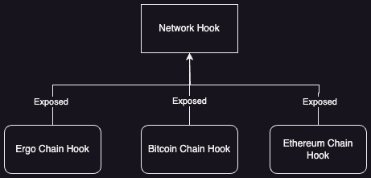
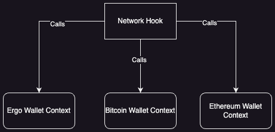

# Multi Network Wallet

This document discusses the intricacies of the multi network wallet.

A multi network wallet is a wallet that can connect to multiple wallets across different blockchain networks.

An example would look like this:

- User connects to Ergo Blockchain, this allows the dApp to retrieve all information regarding the connected wallet on ErgoBlockchain and expose all APIs to the blockchain.
- User then connects to Bitcoin Blockchain, this allows the dApp to retrieve all information regarding the connected wallet on Bitcoin Blockchain and expose all APIs to that blockchain, ALL WHILE maintaining availability of APIs and information to Ergo Blockchain
- This process can be repeated with the other blockchains like Cardano, Ethereum, Solana, Alpheium

## Technical Design

A multi-network wallet is largely similar to a single network wallet. The main point to consider is:

1. Exposing APIs to connect to multiple chain wallets
2. Persistence of Previously connected Wallets Information
3. Exposure of APIs for connected wallets

There are 2 ways to optimize this solution:

1. To create hooks for each network and a high level network hooks that pulls the required information from each network hooks
2. A network hook that persist the networks that have been connected and the current network. Whenever we need to get the information from a specific network, we retrieve it via the blockchain context again.

an illustration of #1:

an illustration of #2:

Both of these solutions have its own pros and cons.

The pros for the one using hooks from each chains:

1. Persisted information
2. Lesser API calls
3. Overview of all information available

Cons:

1. Unnecessary storage of information based on usage
2. Can get complicated
3. Maintenance of hooks required

The pros for the one calling context to retrieve information:

1. Less maintenance required as only one hook is maintained
2. Less storage
3. Less complicated design

Cons:

1. Data are not persisted, this is not good when you need an overview
2. More API calls

Both of these are solutions that can be used in specific scenarios.

## UI Design

In regards to UI, a multi network wallet button can differ from
