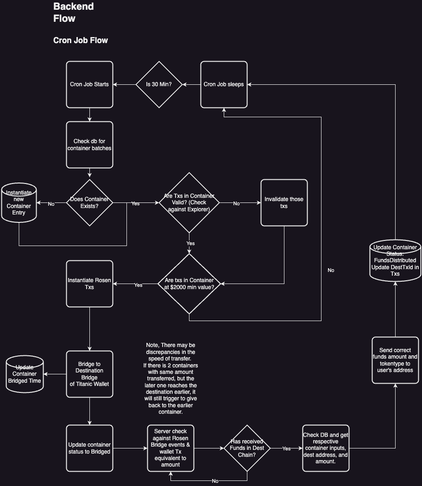
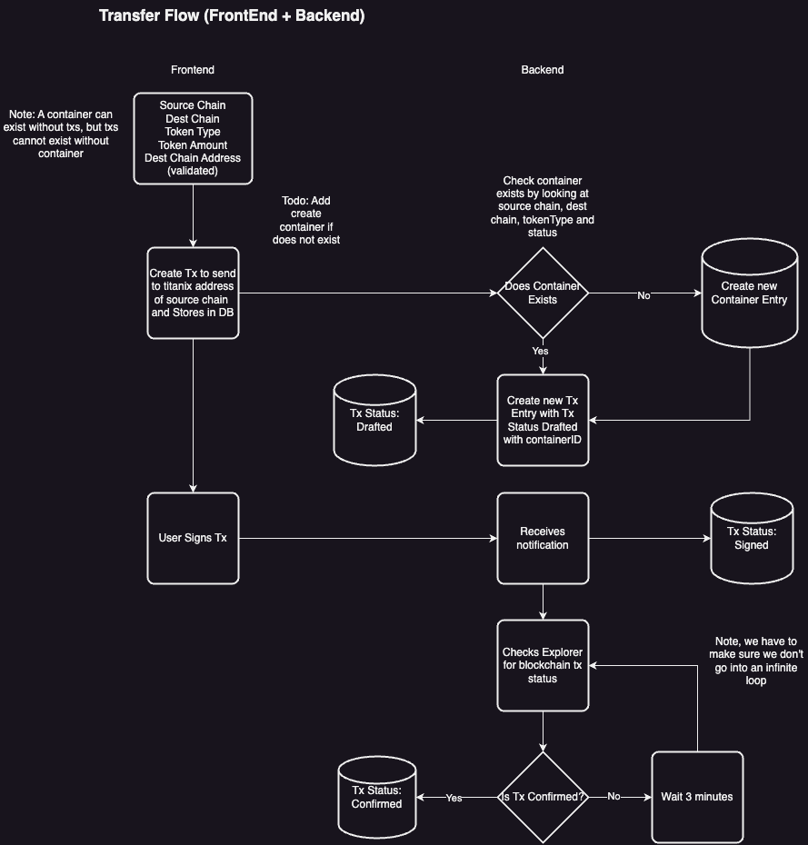
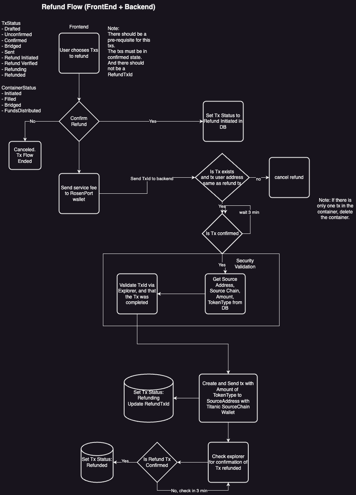
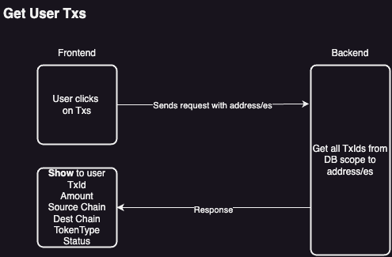
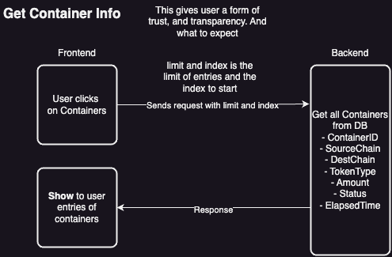

# Rosen Port Flow

Rosen Port consists of 5 main flows:

1. Backend Cron Job - This is where bridging and distribution happens
2. Transfer Flow - Transfering funds from user to rosen port
3. Refund Flow - The entire process of refunding
4. GetUserTx - Getting the txs that the users has made
5. GetContainerInfo - Getting the information of a container

Note that, throughout this document we will be using these terms:

FE is short form for Front-end

BE is short form for Back-end

This two terms is used to describe the part of the system where the flow exists in.

## Backend Cron Job Flow

The backend cron job carries out multiple responsibilities. It checks the statuses of txs and processes, it bridges the funds when the container is filled, and distributes the funds when the container is bridged. Though done using multiple cron jobs, we can understand the process based on the flow chart below:

1. **Cron Job Starts:**

   - The cron job initiates its process.

2. **Is 30 Min?**

   - Checks if 30 minutes have passed since the last run.
     - If **No**, the cron job sleeps.
     - If **Yes**, it proceeds to the next step.

3. **Check db for container batches:**

   - The cron job queries the database for existing container batches.

4. **Does Container Exist?**

   - Verifies if there are any existing containers.
     - If **No**, instantiate a new container entry and return to the start.
     - If **Yes**, it moves to the next step.

5. **Are Txs in Container Valid? (Check against Explorer):**

   - Checks if the transactions in the container are valid by verifying against an external explorer.
     - If **No**, it invalidates those transactions and returns to the start.
     - If **Yes**, it proceeds to the next step.

6. **Are txs in Container at ≥$2000 min value?**

   - Checks if the transactions in the container have a minimum value of $2000.
     - If **No**, it returns to the start.
     - If **Yes**, it moves to the next step.

7. **Instantiate Rosen Txs:**

   - Initiates Rosen transactions within the container.

8. **Bridge to Destination (Bridge of Titanic Wallet):**

   - Bridges the container transactions to the destination, referred to as the Titanic Wallet.
   - Updates the container status to 'Bridged' and logs the bridged time.

9. **Server checks against Rosen Bridge events & wallet Tx equivalent to amount:**

   - The server verifies if the Rosen Bridge events and the wallet transactions match the expected amount.

10. **Has received Funds in Dest Chain?**

    - Checks if the destination chain has received the funds.
      - If **No**, it returns to the start.
      - If **Yes**, it moves to the next step.

11. **Check DB and get respective container inputs, dest address, and amount:**

    - Retrieves the necessary details from the database, including container inputs, destination address, and the amount.

12. **Send correct funds amount and token type to user's address:**

    - Distributes the correct amount and type of tokens to the user's address.

13. **Update Container:**

    - Updates the container status, funds distributed, and the destination transaction ID in the transactions.

14. **Cron Job sleeps:**
    - The cron job completes the cycle and waits until the next scheduled time to restart the process.

In summary, the cron job periodically checks for container batches, validates transactions, bridges the transactions to a destination wallet, verifies the receipt of funds, and finally, distributes the correct funds to the user's address before updating the container status and sleeping until the next run.

## Transfer Flow

This flow involves both the front-end and the back-end. As the user would have to interact with the front-end and approve the transaction for the funds to be transferred to Rosen-Port. Whereas, the back-end has to ensure that it updates the database properly. This is the flow chart:

1. **FE: Validation of data provided by users**

   - The user inputs and the front end validates the source chain, destination chain, token type, token amount, and destination chain address.

2. **FE: Create Tx to send to rosen-port address of source chain and Stores in DB:**

   - A transaction is created to send to the Rosen-Port address of the source chain. This transaction is then stored in the database.

3. **BE: Check container exists**

   - The backend checks if a container exists by examining the source chain, destination chain, token type, and status.
     - If **No**, create a new container entry.
     - If **Yes**, create a new transaction entry with the transaction status set to "Drafted" and linked to the container ID.

4. **BE: Tx Status marked as Drafted:**

   - The transaction status is marked as "Drafted" and stored in the database.

5. **FE: User Signs Tx**

   - The user signs the transaction.

6. **BE: Receives Notification that the User has signed the Tx**

   - When the backend receives the notification of the txs has been signed, the backend will update the database so that the txStatus is marked as signed

7. **BE: Checks Explorer for blockchain tx status**

   - The system checks the blockchain explorer for the status of the transaction.
     - If **No**, wait for 3 minutes and recheck to avoid an infinite loop.
     - If **Yes**, update the transaction status to "Confirmed."

### Additional Notes:

- **Note: A container can exist without txs, but txs cannot exist without container**

  - Containers can be empty (no transactions), but transactions must belong to a container.

- **Transactions**:

  - Fields include:
    TxId, Amount, SourceAddress, DestAddress, TxStatus, RefundTxId, DistributedTxId, and FK ContainerID.

- **Containers**:

  - Fields include: ContainerId, SourceChain, DestChain, TokenType, ContainerStatus, BridgedTime, and CreatedTime.

- **Refund Transactions**:

  - Fields include: refund_id, refund_tx_id, and refund_initiation_tx_id.

- **Ensure system don’t go into an infinite loop**
  - Ensures that the system has safeguards to prevent getting stuck in an endless cycle while checking transaction confirmations.

In summary, this flowchart outlines the process of creating, signing, and confirming transactions within a system that handles both the frontend user interactions and the backend processing and validation, ensuring transactions are properly linked to containers and confirmed on the blockchain.

## Refund Flow

Users are able to request for refunds if the funds have not been bridged. Users essentially send a refund service fee to request for a refund. Once the fee is confirmed, Rosen-Port will provide the refunds. Flow chart:

1. **FE: User chooses Txs to refund**

   - The user selects the transactions they wish to refund. Note that this tx has to satisfy a few criteria. The tx has to be confirmed, it hasn't been bridged, and it has not been refunded before.

2. **FE: Confirmation of Refund**

   - The system asks for confirmation to proceed with the refund.
     - If **No**, the refund process is canceled and the transaction flow ends.
     - If **Yes**, the refund process continues.

3. **BE: Set Tx Status to refund_initiated in DB**

   - The transaction status is updated to "refund_initiated" in the database.

4. **FE: Send service fee to RosenPort wallet**

   - The user sends the service fee to the RosenPort wallet.
   - The transaction ID (TxId) is sent to the backend.

5. **BE: Refund validation**

   - Checks if the transaction exists and if the user address matches the refund initiator.
     - If **No**, the refund is canceled.
     - If **Yes**, proceed to the next step.

6. **BE: Check for Tx Confirmation**

   - Validates the transaction ID via the explorer to ensure the transaction was completed.
   - Checks if the transaction is confirmed.
     - If **No**, waits for x minutes before rechecking.
     - If **Yes**, proceed to the next step.

7. **BE: Get Tx Information from DB**

   - Retrieves the source address, source chain, amount, and token type from the database.

8. **BE: Security Validation**

   - Conducts security validation to ensure the refund process is secure.

9. **BE: Send Refund to user**

   - Creates and sends the refund transaction with the specified amount of the token type to the source address using the Titanic SourceChain wallet.

10. **BE: Set Tx status to refunding**

- Updates the transaction status to "refunding" and updates the RefundTxId.

9. **BE: Check confirmation of refund is completed**

   - Checks the blockchain explorer to confirm the refund transaction.
     - If **No**, waits for 3 minutes before rechecking.
     - If **Yes**, proceed to the next step.

10. **BE: Set Tx Status to refund_completed**
    - Updates the transaction status to "refund_completed."

### Additional Notes:

- **Note: There should be a pre-requisite for this tx.**

  - The transactions must be in a confirmed state and there should not be a RefundTxId. We have to ensure that users can't hack the system whereby they request an infinite refund.

- **Note: If there is only one tx in the container, delete the container.**
  - If only one transaction exists in the container, the container should be deleted after the refund.

In summary, this flowchart outlines the process of selecting, initiating, validating, and completing refunds for transactions within a system, ensuring all necessary checks and updates are made in both the frontend and backend to securely handle refunds.

## Get User Txs

Users are able to see the history of the transactions that they have done. Flow Chart:

1. **FE: User Clicks on Txs**

- This triggers a request to the backend with the users address

2. **BE: Collects and returns Txs Info**

- The backend collects all txs from the wallet address, whereby the wallet address exists on the sent address of source chain and receiving address of dest chain. This is sent back as a response

3. **FE: Display Txs**

- Display the txs to the user

## Get Container Info

Users are able to see the containers that are available and that have been completed. Flow Chart:

1. **FE: Click on containers tab**

- When clicking on the containers tab, the FE sends a request with limit, index and chain (optional) as arguments to the back end.

2. **BE: Collects container info from DB**

- With the arguments, the BE collects the container info and return as a response

3. **FE: Display Containers**

- Display the containers to the user

## Statuses

### Tx Status

- drafted - Tx has been drafted
- unconfirmed - Tx has been signed
- confirmed - Tx is confirmed on the chain
- bridged - Tx has been bridged
- sent - Tx has been sent to the destination address
- refunding - Tx is being refunded
- refund_completed - Refund of tx is completed
- temporary_unavailable - The tx is temporarily unavailable. This is for cases when there is an update in status

### Container Status

- initiated - The container has been initiated and is empty
- filling_in_progress - The container is being filled up (there is at least one tx)
- filled - The container has reached the threshold
- bridging - The container is being bridged
- bridged - The container has finished bridging
- fund_distribution_in_progress - The container's fund is being distributed
- funds_distributed - The container's fund has been distributed

### Refund Status

- refund_initiated - a refund has been initiated
- refund_service_fee_signed - the service fee tx has been signed but not confirmed
- refund_service_fee_confirmed - the service fee has been confirmed on the blockchain
- refund_in_process - The refund is being processed
- refund_completed - The refund has been processed
