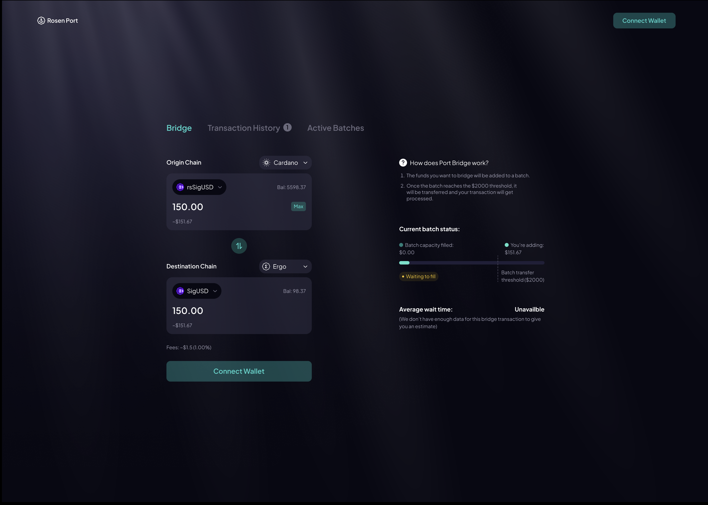
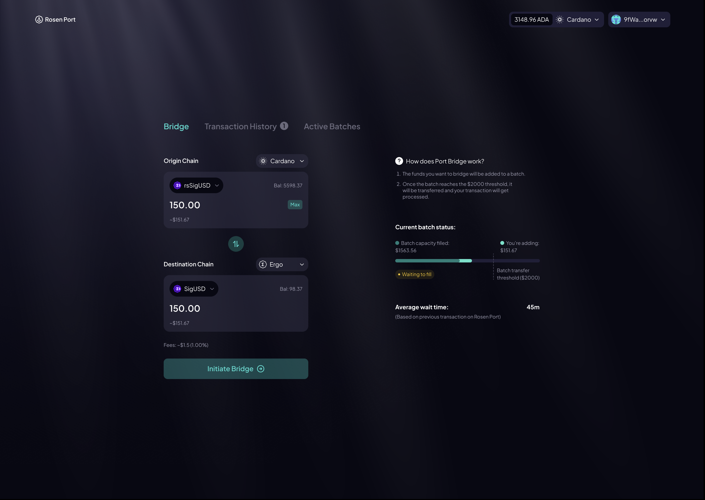
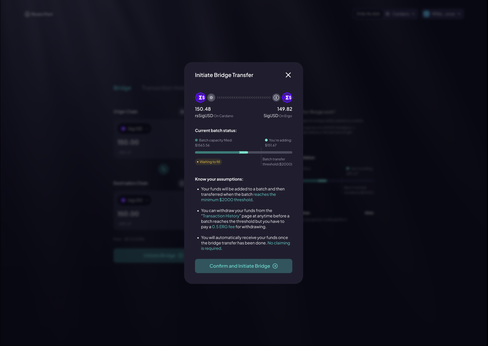
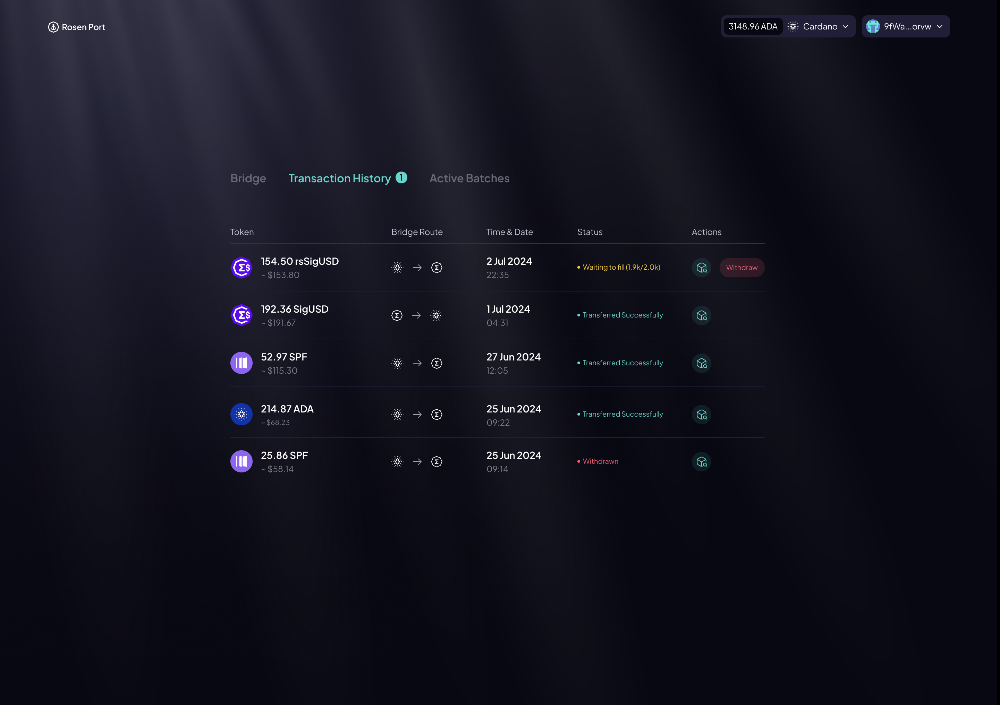
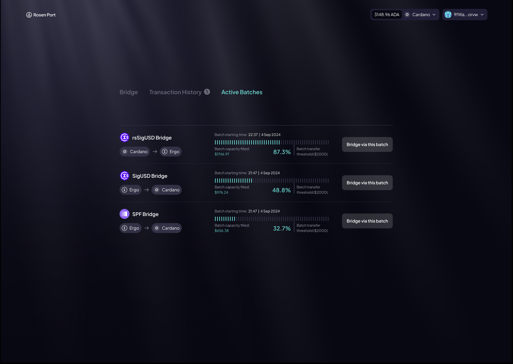

# RosenPortUI

### RP Main Page

### RP Main Page Wallet Connected

### RP Initiate Bridge

### RP Tx History

### RP Active Batches

## Technical

This section discusses the technicality and compartmentalization of components for the UI of RosenPort
