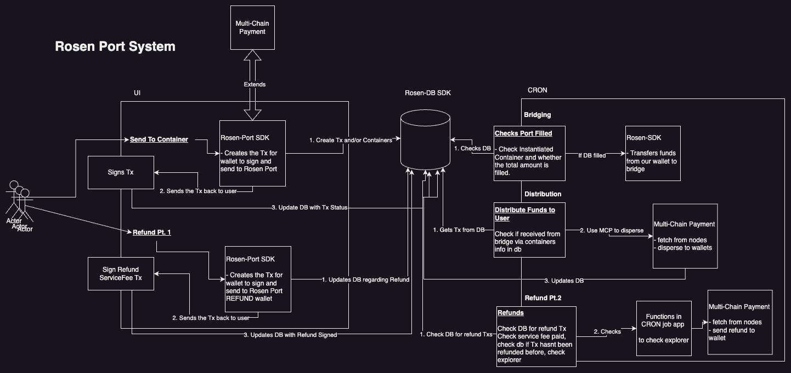
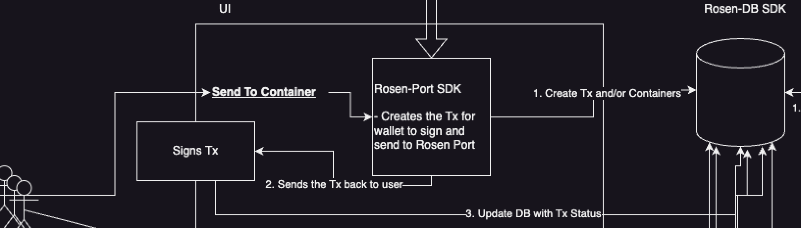
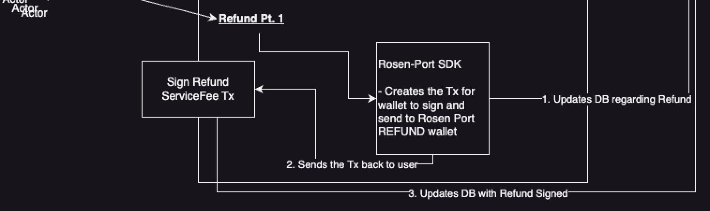
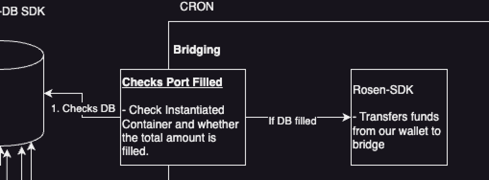
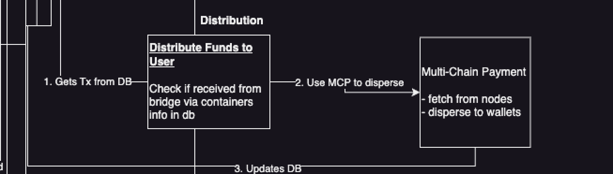
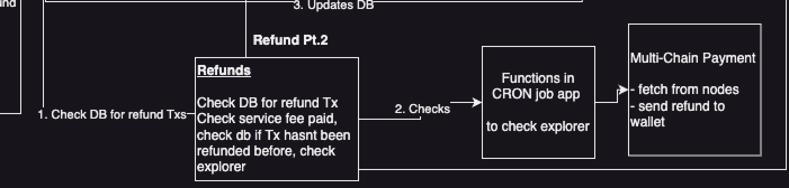

# System Overview

In this document, we will dive into the details of how the system is built. To understand this, we will have to first have the context of the flows.

Please note a few terms:

- RP: RosenPort

### Features recap

To recap, rosen-port has 2 main features.

1. Bridge via container
2. Refunds

To carry out this feature, we have 2 main parts:

1. UI (integrated with server)
2. Cron job

This can be further broken down into smaller features
The UI does these:

1. Allow users to bridge via container by sending funds to RosenPort wallet
2. Allow users to refund a tx that has not been bridged yet
3. Check status of txs and containers

The Cron does these:

1. Bridge the container funds, if it has reached full load amount
2. Distribute funds that has been bridged
3. Complete refund requests by refunding the funds from RosenPort wallet
4. Update DB status for each transactions

A full picture overview of this system looks like this:

Very complicated. So lets break this down.

## Features

### 1. RosenPort UI Bridge via Container

This flow allows users to send funds to the RosenPort wallet on the right chain, and updates the DB with the tx.

The UI will open a browser wallet for the user and have the transaction ready to be signed. This requires RP's server to build the transactions on the specified chain, and pull RP's wallet address from that chain from db for the building of the transaction.

Once user has signed the tx, we immediately make a request to the server to update the db that it has been signed. This is to prevent cron job from searching the blockchain explorer for a transaction to confirm when a transaction was never sent.

**Q: What if user signs, but the server did not manage to store in DB?**
Answer not provided yet

**Q: Does user only pay for the bridging fee?**
No, the user will also have to pay for network fee.

### 2. RosenPort UI Refund

When a user chooses to get a refund. They're basically making a request or contract with RP to return the funds that are not bridged yet.

The funds are refunded by sending it from RP chain wallet to user after ensuring that the refund service fee is provided.

The process therefore looks like this:

1. User makes refund request
2. RP server updates the DB and create service fee transaction and sends it to user
3. User signs service fee transaction (to send to RP)
4. UI sends update to server that the service fee tx was signed, and updates the DB with refund status as SERVICE_FEE_SIGNED

This then prompts the cron job to look for the tx, and send the funds back.

**Q: What happens to the refund status after RP refunded the amount?**
The refund status is updated to REFUNDED to prevent double refund.

**Q: How much is the service fee?**
To be determined, but it should be a fixed amount

### 3. Cron: Bridge Fund

This cron job is in charged of bridging containers that are fully funded over to the destination chain. It has one job and one job only.

Process:

1. Wakes up
2. Check unbridged containers
3. Pull txs from unbridged containers and sum the amount
4. Call Rosen-SDK to get the minimum transfer fee. Calculate if the transfer fee is at minimum, if so, it is ready to be bridged.
5. If ready to be bridged, bridge the funds from source chain to dest chain via rosen-sdk, else continue
6. Update DB (if bridged) and sleep

**Q: Is the minimum fee variable?**
Yes the minimum fee can be variable as its based on price. Therefore we will have to check it every time.

**Q: Can a container have more funds than the threshold?**
Yes, the container can has more than expected amount than threshold, as after threshold, it will be a flat 0.5% fee.

**Q: How does the funds get bridged? Is it via Browser wallet?**
The funds does not get bridged via browser wallet. It gets bridged via node. We will have to be able to build the tx and send the tx via node.

**Q: What if the funds bridged wrongly? Based on Rosen docs, if the funds are bridged improperly, then it will be a donation**
We are working on the SDK with Rosen team to ensure that we build a sdk that works for their UI. Using the SDK is a form of security that we will be able to use it properly as we are taking part in building it and will be utilized by Rosen team.

**Q: How is the threshold determined?**
MinBridgeFee / 0.005

### 4. Cron: Distribute Funds

After receiving the funds from the bridge, the cron job reactivates to disperse the funds back to the users wallets. It pulls the data from the DB, and disperse the funds appropriately.

Process:

1. Wakes up
2. Checks if Bridge is completed for containers
3. Pulls Container Txs
4. Disperse funds to destination addresses
5. Sleep

**Q: How do you know how much to disperse?**
Because the asset that is bridge is the same asset, but wrapped. The amount to be dispersed is exactly the amount that they chose to bridged.

**Q: How do you check if the funds have been bridged?**
TBD (#TODO KII)

### 5. Cron: Process Refunds

Once the refund service fee has been sent by users. The Cron job then take charge of processing the refund and returning it back to users. This includes checking if the service fee has been paid, and then sending the amount of tokens back to user.

Process:

1. Wake up
2. Pull open refunds from DB
3. Checks if refund service fee has been paid for each refunds.
4. If paid, send funds from chain's RP wallet to address
5. Update DB as refunded (if refund is processed)
6. Sleep

**Q: What if the db gets altered and refunds that have been refunded gets changed to ready for process**
TBD (#TODO Kii)
