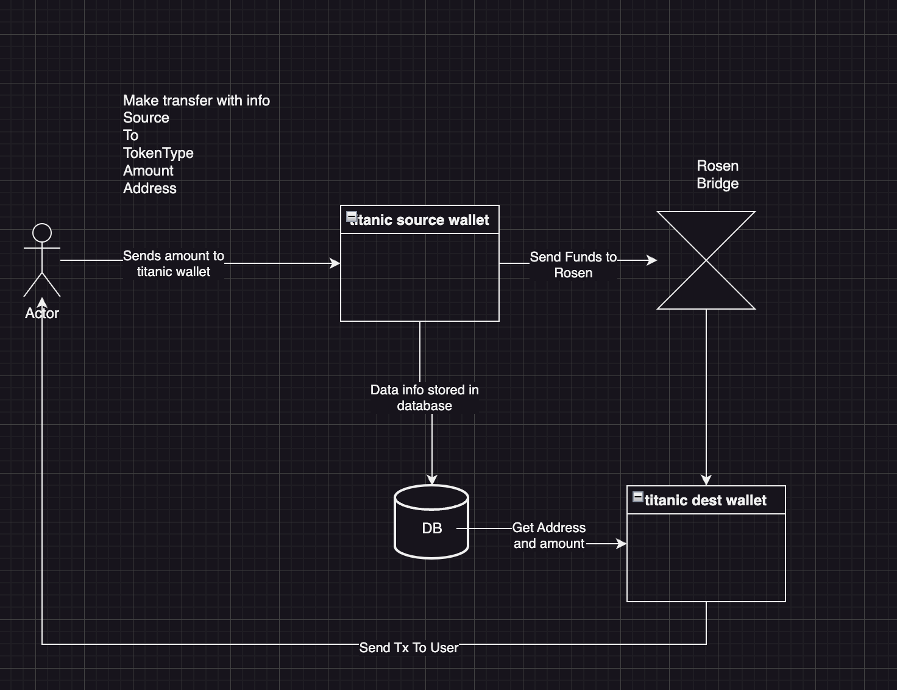

# Rosen-Port

This is the documentation for Rosen-Port.

What does this documentation talk about?
It discusses a high level overview of Rosen-Port. And goes into the design and features of it. Not only that, it will cover some timeline and the engineering design for the port.

## Start up

First you will need to link rosen-sdk, in the future, this will likely be a package, but for the time being, it can be found in the public repo: https://github.com/rosen-bridge/rosen-sdk

From the parent directory of the rosen-port, download and link rosen-sdk by running:

```bash
git clone https://github.com/rosen-bridge/rosen-sdk.git
cd rosen-sdk
npm link
cd ../rosen-port
npm link ../rosen-sdk
```

To start the project, you'll have to build and run both the Cron job and the Ui. You can do that by:

Run build.sh. This builds all the packages that rosen-port uses.

```bash
npm i
./build.sh
```

To run UI, go to:
```bash
cd apps/rosen-port-ui
```
create an .env file and set the appropriate keys

then run ui:

```bash
npm run dev
```

After running the UI, you can run the cron job by running:

```bash
cd apps/rosen-port-cron
npm run start
```

## Problem Statement

current Rosen bridge design cost too much for a smaller amount of token sent.

## Description and Goal

The current design of Rosen bridge requires a minimum fee of $10 and a maximum of 0.5% for maximum fee.
The smallest amount to hit the 0.5% fee structure is 2000, which is quite high. Otherwise they are stuck on the flat fee of 10 bucks, resulting in a much higher percentage surcharge per transaction.

For the vast majority of holders, this is a considerable amount to spend. Especially in an immutable environment, where it is better to validate the bridge with a smaller amount - this leads to incurring high fees.

This transfer cost becomes a barrier for the market stated above.

Our goal is to build a system that is more inclusive and allows everyone to participate in Rosen bridge and increase adoption - irrespective of the amount of tokens they hold.

## Design Overview

The system to counteract this problem can be achieved by building a shipping container system/batching system. The container gets filled up by smaller amount and departs every 30 minutes if and only if the container (batch) reaches the minimum threshold (total amount of tokens are worth $2000). The collected tokens are transferred across the rosen bridge and once that process is completed, another batch job runs to transfer bridged assets back to the user’s wallet on the other chain.

100 ft birds eye view of the proposed process (does not include any technical implementation details)



Note that “sending funds to rosen” is a backend process that is done through utilizing the software logic from Rosen, so that it is integrated in the system itself.

## Specs

For this project to be considered done, we need these to be completed:

1. Rosen-SDK: So that we can interact with Rosen-bridge efficiently (this will be implemented in Rosen-Port-Cron)
2. Rosen-Port-UI: The UI will be deployed for users to interact. This UI will interact with Rosen-Port-SDK to sign transactions to send to Port wallet. It will then call the backend, and store the required information on DB.
   Features includes:
   a. add to container (bridge)
   b. refund
   c. view transactions
3. Rosen-Port-Cron:
   Rosen port cron handles:
   a. Verifying funds status
   b. Bridging funds
   c. Distributing funds
   d. Refunding funds

### Additional Documentations

- [Feature Specifications](./docs/FeaturesSpecs.md)
  A high level overview of the features from Rosen Port
- [Rosen Port System Design](./docs/SystemOverview.md)
  The technical design of the system, discusses the processes at a high level
- [Rosen Port Flow Diagrams](./docs/RosenPortFlow.md)
  Dives deeper into the step by step flow for each part of the design.
- [Rosen Port UI (Contains UI Pictures)](./docs/RosenPortUI.md)
  UI that includes pictures of what the website will look like
- [Rosen Port Cron](./docs/RosenPortCron.md)
  Discusses the technical specs and details of the cron job.
